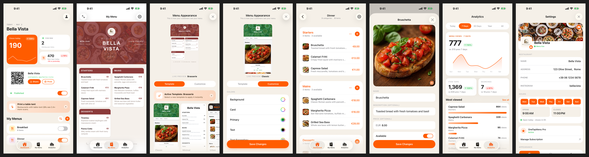
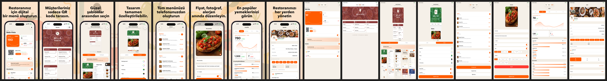
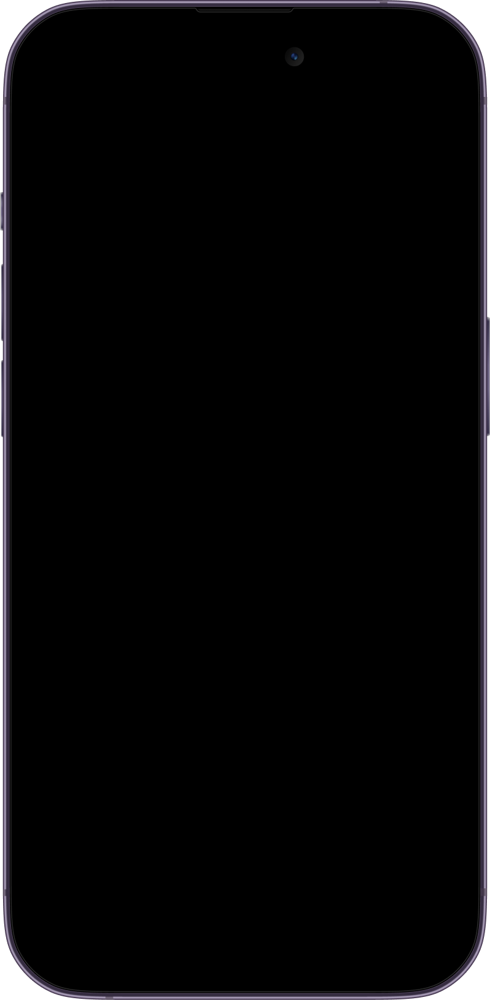
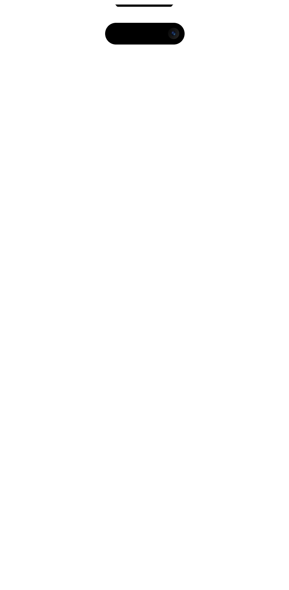
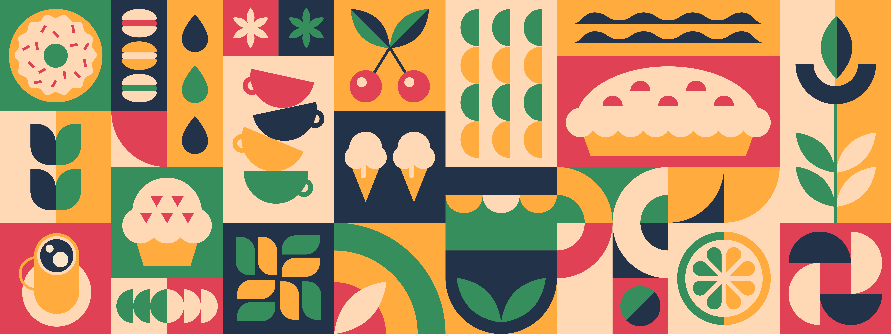

# App Store Preview Generator

If you support multiple languages and devices, the number of screenshots adds up fast. 8 screens x 4 languages x 2 device types = 64 images. Doing that by hand every release is not realistic.

I got tired of creating App Store screenshots one by one. Every time the UI changed, I had to redo them for every screen, every language. So I wrote a script that does it for me.

The idea is simple: take a background image, split it across N screens, put a device-framed screenshot in each one, add a title on top. Done.

This script handles the iPhone framing. iPad screenshots are currently copied as-is (iPad framing may come later). I use Fastlane to run UITests and capture screenshots across all my localizations (iPhone + iPad). Then this script processes them into App Store-ready cards. Then Fastlane uploads them. The whole thing runs with one command.

## Examples

### English (en-US)

Raw Fastlane screenshots:



After processing:


### Turkish (tr)

Raw Fastlane screenshots:


After processing:



## What It Does

Takes your Fastlane screenshots and frames them into App Store preview cards:

- Composites screenshots into an iPhone device frame with Dynamic Island
- Adds configurable title and subtitle text above the device
- Applies a panoramic background image (or gradient fallback) across all cards
- Supports multi-line titles, per-screenshot font/color overrides, and text shadows
- Generates a preview sheet showing all cards side-by-side
- iPad preview generation is TBD -- currently copies iPad screenshots as-is for Fastlane upload

## Quick Start

```bash
# 1. Install the dependency
pip install Pillow

# 2. Add your screenshots
#    Place Fastlane screenshots in screenshots/{locale}/
#    e.g. screenshots/en-US/iPhone 16 Pro Max-01_Dashboard.png

# 3. Configure your titles
#    Edit metadata/en-US.json (see below)

# 4. Generate
python3 generate_previews.py --all
```

Output lands in `output/{locale}/`.

## Directory Structure

```
app-store-preview-generator/
    generate_previews.py        # The script
    config.json                 # Global layout, typography, colors
    phone.png                   # iPhone frame (800x1630, RGBA)
    notch_camera.png            # Dynamic Island overlay (RGBA)
    banner.jpg                  # Background image (optional)
    metadata/
        en-US.json              # Titles per screenshot per locale
        de-DE.json
        ...
    screenshots/                # Raw Fastlane screenshots (input)
        en-US/
            iPhone 16 Pro Max-01_Dashboard.png
            ...
    output/                     # Generated previews (output)
        en-US/
            01_Dashboard.png
            ...
        preview_sheet_en-US.png
```

## Usage

```bash
# Single locale
python3 generate_previews.py --locale en-US

# All locales (auto-discovered from metadata/)
python3 generate_previews.py --all

# Override screen region (x,y,w,h in frame coordinates)
python3 generate_previews.py --all --screen-region 32,12,736,1600
```

## Configuration

### config.json

Controls the global layout, typography, and visual style.

```jsonc
{
  // Background image filename (falls back to gradient if missing)
  "banner_file": "banner.jpg",

  "layout": {
    "phone_scale": 0.88,           // Phone width as fraction of card width
    "phone_bottom_pad": -200,      // Negative = phone overlaps card bottom
    "text_top_pad": 140,           // Top of card to title text
    "title_subtitle_gap": 28,      // Gap between title and subtitle
    "screen_region": [30, 30, 740, 1570],  // Screenshot region in phone.png coords [x,y,w,h]
    "screen_corner_radius_ratio": 0.15     // Corner radius as fraction of screen width
  },

  // Title typography
  "title_font": { "family": "Avenir Next", "weight": "Bold", "size": 136 },
  "title_color": "#000000",
  "title_line_extra": 12,          // Extra line spacing for multi-line titles

  // Subtitle typography
  "show_subtitle": false,
  "subtitle_font": { "family": "Avenir Next", "weight": "Medium", "size": 68 },
  "subtitle_color": "#3C3C3E",

  // Text shadow
  "text_shadow": false,
  "text_shadow_color": "#FFFFFF",
  "text_shadow_blur": 60,

  // Background overlay (mutes the background for text readability)
  "bg_overlay_color": "#F9DAB9",
  "bg_overlay_opacity": 75,        // 0-100

  // Gradient fallback (used when no banner image is found)
  "gradient_fallback": { "top_color": "#FF5C00", "bottom_color": "#CC3300" },

  // iPad support
  "generate_ipad_previews": false,
  "ipad_layout": {
    "text_top_pad": 220,
    "title_subtitle_gap": 40,
    "screenshot_top_pad": 460,
    "screenshot_side_pad": 40,
    "screenshot_bottom_pad": 80,
    "screen_corner_radius": 50
  }
}
```

### metadata/{locale}.json

Defines titles and subtitles for each screenshot, per locale.

```json
{
  "screenshots": [
    {
      "file": "01_Dashboard",
      "title": "Create a\ndigital menu\nfor your restaurant",
      "subtitle": ""
    },
    {
      "file": "02_Templates",
      "title": "Choose from\nbeautiful\ntemplates",
      "subtitle": "Pick one that fits your brand"
    }
  ]
}
```

Use `\n` in titles for multi-line text.

#### Per-screenshot overrides (WIP)

The code supports overriding font and color per screenshot, but this hasn't been fully tested yet:

```json
{
  "file": "03_Special",
  "title": "Something bold",
  "title_font_family": "Helvetica",
  "title_font_weight": "Bold",
  "title_font_size": 100,
  "title_color": "#FF0000"
}
```

## Assets

### phone.png

An 800x1630 RGBA PNG of an iPhone silhouette (black body, transparent background). The script composites the screenshot into the screen region defined in `config.json`.



### notch_camera.png (optional)

Same dimensions as phone.png. Contains the Dynamic Island overlay. The script auto-detects the notch bounds from the alpha channel and fills it with a black pill.



### banner.jpg (optional)

A wide background image. The script scales it to span all cards panoramically, so each card gets a different slice of the same image. If no banner is found, it falls back to the gradient defined in config.



**Background overlay:** My banner is actually quite busy, which makes the title text hard to read. So I use `bg_overlay_color` and `bg_overlay_opacity` in config.json to lay a semi-transparent color on top. In my case, `#F9DAB9` at 75% opacity gives a warm, muted background that keeps the banner texture visible but doesn't compete with the text or the screenshots. You can adjust the color and opacity to match your brand.

## Adding a New Locale

1. Create `metadata/{locale}.json` with your translated titles
2. Add Fastlane screenshots to `screenshots/{locale}/`
3. Run `python3 generate_previews.py --locale {locale}`

Locales are auto-discovered from the `metadata/` directory.

## Fonts

The script has built-in support for **Avenir Next** (macOS system font) with all weight variants. For other fonts, it searches:

- `/System/Library/Fonts/{family}.ttf`
- `/Library/Fonts/{family} {weight}.ttf`
- `/Library/Fonts/{family}-{weight}.ttf`

Falls back to Pillow's default font if nothing is found.

## Integrating with Fastlane

The script expects `screenshots/` and `output/` as sibling directories. The easiest way to set it up is to clone this repo inside your `fastlane/` folder:

```
your-app/
  fastlane/
    Fastfile
    preview_generator/          ← clone this repo here
      generate_previews.py
      config.json
      phone.png
      notch_camera.png
      banner.jpg
      metadata/
        en-US.json
        ...
      screenshots/              ← Fastlane writes here
        en-US/
          iPhone 16 Pro Max-01_Dashboard.png
          ...
      output/                   ← script writes here
        en-US/
          01_Dashboard.png
          ...
```

Then point your Fastlane `capture_screenshots` output and `deliver` input at the right folders.

### File naming

Fastlane names screenshots like `iPhone 16 Pro Max-01_Dashboard.png`. The script strips everything before the first `-` to get the key (`01_Dashboard`), then matches it against the `"file"` field in your metadata JSON. If your files don't have a device prefix, that works too -- `01_Dashboard.png` matches `"file": "01_Dashboard"` the same way.

### Example Fastfile lanes

```ruby
# 1. Capture screenshots via UITests
lane :screenshots do
  capture_screenshots(
    scheme: "YourApp",
    devices: ["iPhone 16 Pro Max"],
    languages: ["en-US", "de-DE"],
    output_directory: "./preview_generator/screenshots"
  )
end

# 2. Generate framed preview cards
lane :previews do
  sh("python3 preview_generator/generate_previews.py --all")
end

# 3. Upload to App Store Connect
lane :upload_previews do
  deliver(
    api_key: api_key,
    skip_binary_upload: true,
    skip_metadata: true,
    screenshots_path: "./preview_generator/output",
    overwrite_screenshots: true,
    force: true
  )
end

# Or run all three in one shot
lane :screenshots_and_upload do
  screenshots
  previews
  upload_previews
end
```


## Requirements

- Python 3.10+
- [Pillow](https://python-pillow.org/) (`pip install Pillow`)

## License

MIT
